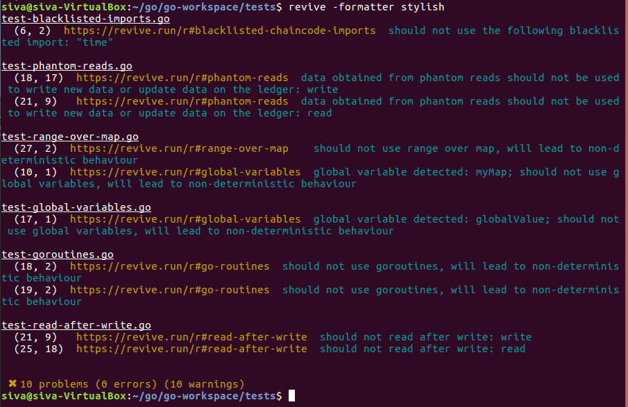
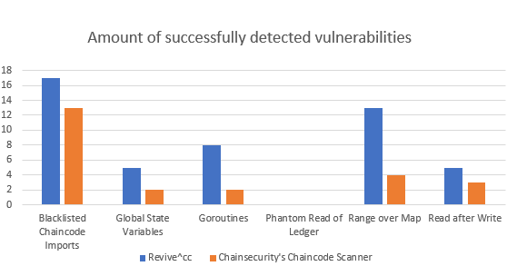
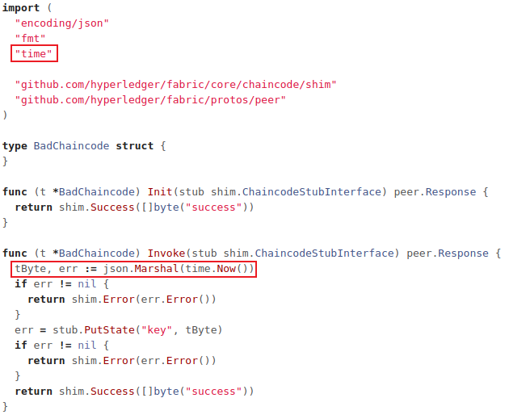
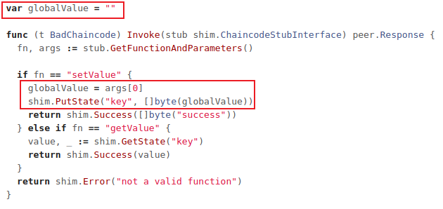
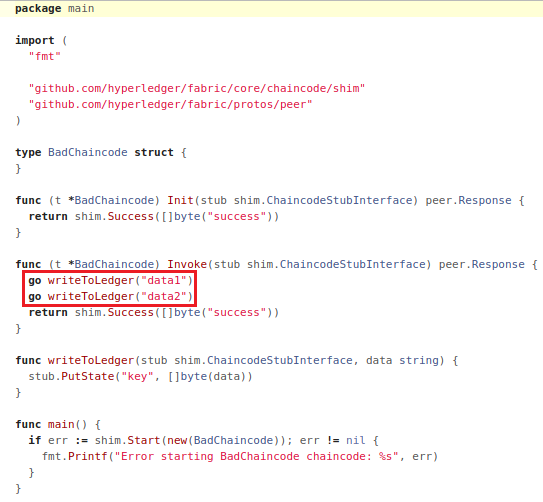
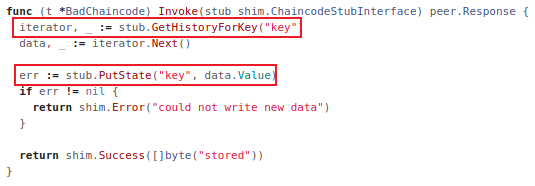
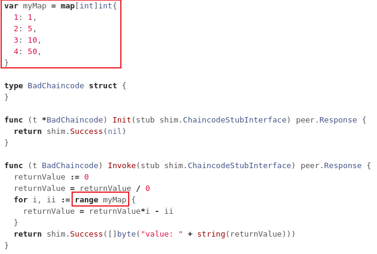

# revive^CC
**`revive^CC`** is a static analysis tool for Hyperledger Fabric smart contracts (chaincode) aimed at detecting blockchain related security vulnerabilities to help developers to write clean and safe smart contracts. **`revive^CC`** is one of the two existing static analysis tools for Hyperledger Fabric chaincode, with the other tool being <a href="https://chaincode.chainsecurity.com/">Chainsecurity's Chaincode Scanner</a> which can analyse chaincode files that meet certain requirements. What makes **`revive^CC`** special is that the tool has brought the accessibility of security analysis to ***any chaincode file***. This is something that has not been available until now.

The tool is an extension of the open source Go static analysis tool <a href="https://github.com/mgechev/revive">revive</a> and was built using revive's framework. Therefore it contains all the benefits and checks of revive to help developers write clean Go code. **`revive^CC`** was built as a part of my dissertation project on 'Analysing Smart Contracts' at the University of Sheffield.


## Installation
```
1. Place folder in the your $GOPATH/src/github.com/youraccount
2. Go into directory sivachokkapu/revive-cc
3. $ make install
4. $ make build
5. Move the revive file into $GOPATH/bin
6. You should now be able to use revive commands
```

## Usage
```
$ revive {chaincodefilename.go} - will analyse the file
$ revive -formatter stylish {chaincodefilename.go} - better output format
$ revive - on a directory will analyse all files if from the same package
```

<p align="center">
  
  <br>
  Using $ revive on a directory
</p>

## Performance
<p align="center">
  
</p>
To evaluate the performance of revive^CC, a variety of real case chaincode files were found which each contained vulnerabilities. A total of 20 public chaincode files were obtained for the evaluation from GitHub repositories. All these files were verified and the following vulnerabilities were reported. The performance was then compared with Chainsecurity's Chaincode Scanner which was only able to verify 13 out of the 20 files. Overall, revive^CC was able to detect more vulnerabilities (please note as revive^cc is able detect more true positives it also detects slightly more false positives).

## Detectable vulnerabilities

### Blacklisted chaincode imports
<p align="center">
  
  <br>
  Example of blacklisted chaincode import vulnerability in chaincode
</p>
Importing certain libraries may result in a lack of consensus between peers. This is because certain libraries will allow communication with the outside world, grant file access and can even introduce non-deterministic behaviour into chaincode. These can all lead to inconsistent computation between peers leading to a lack of consensus.
One blacklisted library is the ‘time’ library. This library allows peers to get the current timestamp at a given time, however, it is unlikely that each peer will create the same timestamp during a transaction leading to discrepancies between peers. This can result in non-deterministic behaviour between peers, leading to inconsistent computation.

### Global state variables
<p align="center">
  
  <br>
  Example of global state variable vulnerability in chaincode
</p>
Global variables are only global to a single peer as global variables are not tracked on the ledger. Not ever peer will necessarily execute every transaction and as the global variable’s scope is limited to a single peer, their states may diverge. No data that is being read from or written to should depend on these global state variables as this can lead to computation with different read and write sets. This non-consistent computation will result in a lack of consensus between peers and therefore all transactions will be marked as invalid.

### Goroutines
<p align="center">
  
  <br>
  Example of goroutines vulnerability in chaincode
</p>
Goroutines introduce concurrency into chaincode. Which can then bring about non-deterministic behaviour. This can lead to inconsistent computation between peers due to peers not computing the same read and write sets. This will result in a lack of consensus between peers on the network leading to all the transactions being marked as invalid. Therefore it is highly discouraged to use goroutines.

### Phantom read of ledger
<p align="center">
  
  <br>
  Example of phantom read of ledger vulnerability in chaincode
</p>
Getting data from the ledger using GetHistoryOfKey or GetQueryResult do not pass the versioning control of the system. This means that data retrieved using these methods should not be used to write any new data or update data on the ledger. This could lead to unexpected behaviour which may affect the execution of transactions and cause unintended results.

### Range over map
<p align="center">
  
  <br>
  Example of range over map vulnerability in chaincode
</p>
The range keyword allows the ability to iterate through every element in various data structures in Go. However, when range is applied to a map, the iteration order will be randomised in Go. This means that using range to iterate through elements of a map is not deterministic as the order of iteration can change between every execution. Therefore computation between peers will not be consistent and it will be impossible for peers of the network to reach consensus.

### Read after write
<p align="center">
  
  <br>
  Example of read after write vulnerability in chaincode
</p>
For a write to ledger statement to take effect, the transaction first must be committed and written to the ledger. Until then the value that has been written to will retain its old value. Which means that reading this value from the ledger will just return the old value which is likely not what is intended by the chaincode. This will lead to unexpected behaviour which may affect the execution of transactions and cause unintended results.


## License

MIT

[](https://travis-ci.org/mgechev/revive)
